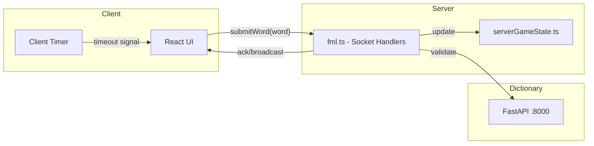

# End Word MVP Implementation Plan

## Current State Summary

You have a functional foundation:

- Socket.IO real-time communication working
- Turn rotation and match letter logic working  
- Player join/leave flow working
- Dictionary API working (FastAPI on port 8000)
- Basic UI exists

The main gaps are: word validation disabled, no win condition, some redundant server code.

---

## Architecture Decision: Keep It Simple

For MVP speed, I recommend:



**Key decisions:**

- Keep using [fml.ts](src/server/fml.ts) as your main handler (abandon the old socketHandlers.ts for now)
- Timer lives on client only (server just validates words, doesn't track time)
- Use ack callbacks for responses (your current pattern)

---

## Phase 1: Stabilize Server (fml.ts)

**Goal:** Clean up redundant code, ensure 5-player support works

### 1.1 Remove duplicate emissions in handleSubmitWord

Current code in [fml.ts:79-81](src/server/fml.ts) does three things:

```typescript
broadcastGameState(socket, clientState);  // broadcast to others
socket.emit("gameStateUpdate", clientState);  // emit to sender
ack({ success: true, gameState: clientState });  // ack to sender
```

**Change to:**

- Keep only `ack()` for the submitting player
- Keep `broadcastGameState()` for other players
- Remove the redundant `socket.emit()`

### 1.2 Add error responses to handleSubmitWord

Currently returns silently on validation failures. Add ack responses:

```typescript
if (word.length === 0 || word[0] !== currentMatchLetter) {
    ack({ success: false, reason: "Word must start with: " + currentMatchLetter });
    return;
}
```

### 1.3 Verify MAX_PLAYERS is 5

Check [src/shared/consts.ts](src/shared/consts.ts) - should already be set.

---

## Phase 2: Enable Word Validation

**Goal:** Actually validate words against the Korean dictionary

### 2.1 Fix the API URL in utils.ts

In [src/shared/utils.ts:120](src/shared/utils.ts), change:

```typescript
// FROM:
const res = await fetch("/dictionary/word/" + input);

// TO:
const res = await fetch("http://localhost:8000/lookup/" + input);
```

### 2.2 Remove the bypass

In [src/shared/utils.ts:116-117](src/shared/utils.ts), remove:

```typescript
console.warn("skipping this for dev purposes");
return true;
```

### 2.3 Handle dictionary response format

Your FastAPI returns `{}` for not found, object with data for found. Current code handles this correctly.

---

## Phase 3: Add Timer (Client-Side)

**Goal:** 15-second timer per turn. Timeout = invalid submission.

**Recommendation:** Timer is simplest for MVP because:

- No new server state needed
- Natural game pressure
- Easy to understand

### 3.1 Create Timer component

Create new file `src/app/components/Timer.tsx`:

- Props: `duration`, `onTimeout`, `isActive`, `resetKey`
- Shows countdown (15, 14, 13...)
- Calls `onTimeout()` when reaches 0
- Resets when `resetKey` changes (new turn)

### 3.2 Integrate Timer into Game.tsx

In [src/app/components/Game.tsx](src/app/components/Game.tsx):

- Add Timer component above/near the input
- `isActive` = true when it's this player's turn
- `resetKey` = `gameState.turn` (resets on each turn)
- `onTimeout` = submit empty word or skip turn

### 3.3 Handle timeout

When timer hits 0:

- Option A: Auto-submit invalid word (simplest - triggers existing validation failure)
- Option B: Emit new "timeout" event (more code)

**Recommend Option A** for MVP speed.

---

## Phase 4: Add Lose Condition

**Goal:** Player who submits invalid word or times out loses the game.

### 4.1 Add game-over state

In [src/shared/types.ts](src/shared/types.ts), the `GameStatus` already has `"finished"`:

```typescript
export type GameStatus = "waiting" | "playing" | "finished" | null;
```

### 4.2 Track loser in game state

Add to `GameState`:

```typescript
loser?: number;  // seat of losing player
```

### 4.3 Set loser on invalid submission

In [fml.ts handleSubmitWord](src/server/fml.ts):

```typescript
if (!validWord) {
    const nextState = { ...state, status: "finished", loser: currentPlayerSeat };
    setGameState(nextState);
    broadcastGameState(socket, toGameStateClient(nextState));
    ack({ success: false, reason: "Invalid word - you lose!" });
    return;
}
```

### 4.4 Show game-over UI

In [Game.tsx](src/app/components/Game.tsx), add overlay when `status === "finished"`:

```
Game Over!
[Winner name] wins!
[Play Again] button
```

---

## Phase 5: Polish UI

**Goal:** Remove debug info, add feedback

### 5.1 Remove debug JSON

In [Game.tsx:57](src/app/components/Game.tsx), remove:

```tsx
<p>Game State: {JSON.stringify(gameState)}</p>
```

### 5.2 Add invalid word feedback

When `ack.success === false`, show error message briefly (toast or input shake).

### 5.3 Show timer prominently

Style the timer to be visually prominent (large numbers, color change when low).

---

## Testing Checklist

Before calling it MVP:

- [ ] 2 players can join and take turns
- [ ] 3+ players can join (up to 5)
- [ ] Invalid words are rejected with feedback
- [ ] Timer counts down and triggers loss on timeout  
- [ ] Game shows winner when someone loses
- [ ] Refresh doesn't break the game (returning player works)

---

## File Summary

| File | Changes |

|------|---------|

| [src/server/fml.ts](src/server/fml.ts) | Remove redundant emit, add error acks, add lose condition |

| [src/shared/utils.ts](src/shared/utils.ts) | Fix dictionary URL, remove bypass |

| [src/shared/types.ts](src/shared/types.ts) | Add `loser?: number` to GameState |

| [src/app/components/Timer.tsx](src/app/components/Timer.tsx) | **NEW** - countdown component |

| [src/app/components/Game.tsx](src/app/components/Game.tsx) | Add Timer, game-over overlay, remove debug |

---

## Estimated Time

| Phase | Time |

|-------|------|

| Phase 1: Stabilize Server | 30 min |

| Phase 2: Word Validation | 15 min |

| Phase 3: Timer | 1-2 hours |

| Phase 4: Lose Condition | 1 hour |

| Phase 5: Polish | 30 min |

| **Total** | **3-4 hours** |