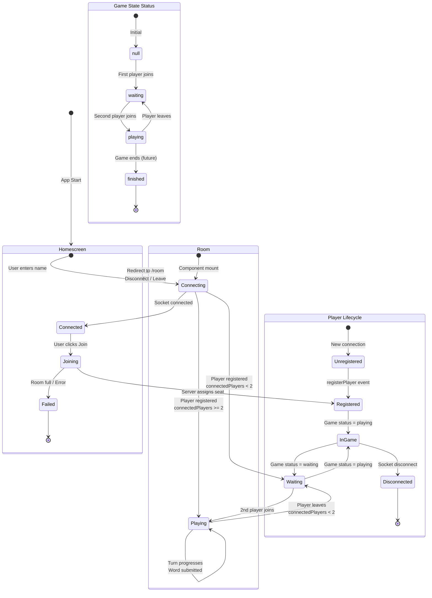
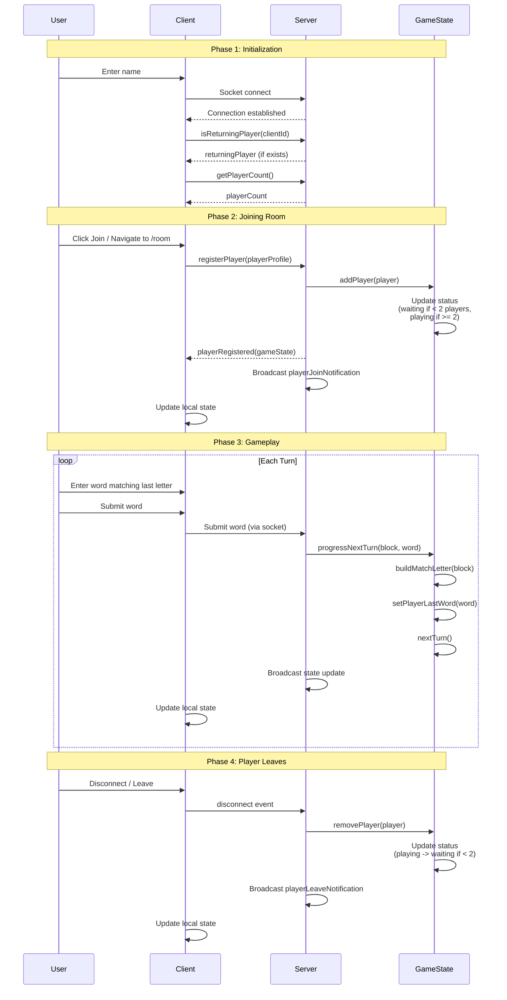

# App State Diagram - High Level Over Time

## State Flow Diagram



## Timeline View



## State Structure Over Time

```mermaid
graph TB
    subgraph "Initial State (null)"
        I1[status: null<br/>players: [null, null, ...]<br/>turn: 0<br/>connectedPlayers: 0]
    end
    
    subgraph "Waiting State (1 player)"
        W1[status: waiting<br/>players: [Player1, null, ...]<br/>turn: 0<br/>connectedPlayers: 1]
    end
    
    subgraph "Playing State (2+ players)"
        P1[status: playing<br/>players: [Player1, Player2, ...]<br/>turn: 0<br/>connectedPlayers: 2<br/>matchLetter: 가]
        P2[status: playing<br/>players: [Player1, Player2, ...]<br/>turn: 1<br/>connectedPlayers: 2<br/>matchLetter: 다<br/>Player1.lastWord: 가나다]
        P3[status: playing<br/>players: [Player1, Player2, ...]<br/>turn: 0<br/>connectedPlayers: 2<br/>matchLetter: 라<br/>Player2.lastWord: 다라마]
    end
    
    I1 -->|First player joins| W1
    W1 -->|Second player joins| P1
    P1 -->|Player1 submits word| P2
    P2 -->|Player2 submits word| P3
    P3 -->|Player1 submits word| P1
    
    style I1 fill:#ffcccc
    style W1 fill:#ffffcc
    style P1 fill:#ccffcc
    style P2 fill:#ccffcc
    style P3 fill:#ccffcc
```

## Key State Transitions

| From State | To State | Trigger | Action |
|------------|----------|---------|--------|
| `null` | `waiting` | First player joins | `addPlayer()` → `_postPlayerCountUpdateState()` |
| `waiting` | `playing` | Second player joins | `addPlayer()` → `_postPlayerCountUpdateState()` |
| `playing` | `waiting` | Player leaves (count < 2) | `removePlayer()` → `_postPlayerCountUpdateState()` |
| `playing` | `playing` | Word submitted | `progressNextTurn()` → `nextTurn()` |
| Any | Any | Player joins/leaves | `updateConnectedPlayersCount()` |

## Component State Mapping

| Component | Local State | GameState Dependency |
|-----------|-------------|---------------------|
| `Homescreen` | `playerCount`, `retryCount`, `returningPlayer` | None (pre-game) |
| `GameContainer` | `userIsConnected` (CONNECTING/CONNECTED/FAILED) | Receives initial `gameState` from server |
| `Game` | Uses `useReducer` with `gameStateReducer` | Manages local `gameState` via reducer |

## Notes

- **GameState.status** transitions: `null` → `waiting` → `playing` → `waiting` (if players drop) → `playing` (if players rejoin)
- **Server** maintains authoritative `GameState<ServerPlayers>`
- **Clients** maintain local `GameState<ClientPlayers>` synced via socket events
- **Turn progression** happens via `progressNextTurn()` which chains: `buildMatchLetter()` → `setPlayerLastWord()` → `nextTurn()`
- **Player count** automatically updates game status: `connectedPlayers >= 2` → `playing`, else → `waiting`

